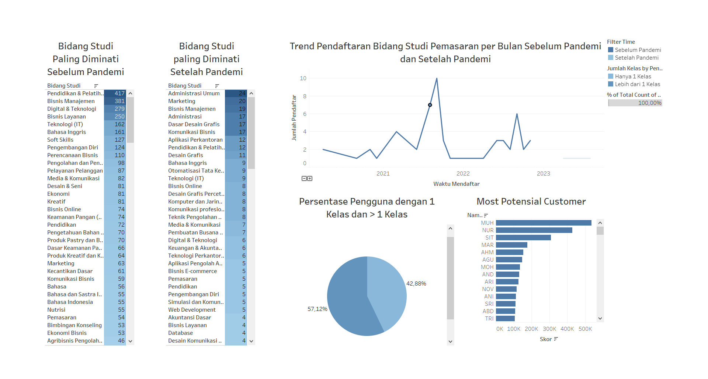

# Online Learning Data Analysis

## Project Overview
This project analyzes user learning behavior on the MasaDepan.ku online learning platform. The analysis aims to identify user learning patterns, evaluate engagement and course completion, and generate insights to support data-driven decision-making.

## Dataset
- **Source:** PT Semesta Integrasi Digital
- **Total Records:** 5,430
- **Topic:** User learning activity on the MasaDepan.ku platform

## Project Objectives
- Analyze user demographics
- Identify the most popular study fields
- Measure course completion rates
- Evaluate learning performance through scores and ratings
- Generate actionable business insights and recommendations

## Tools & Technologies
- Python
- Pandas
- NumPy
- Google Colab
- Tableau

## Data Cleaning
The following data preprocessing steps were performed:
- Converted data types
- Handled missing values
- Checked duplicate records
- Corrected inconsistent values and typographical errors
- Detected and handled outliers

## Exploratory Data Analysis
The analysis includes:
- User distribution by gender
- User distribution by age
- Most popular study fields
- Course ratings
- Final score distribution
- Learning activity and completion

## Dashboard
An interactive dashboard was created using Tableau to visualize the key findings.

## Dashboard Preview



## Repository Contents

```
├── README.md
├── online_learning_data_analysis.ipynb
├── online_learning_dashboard.twbx
└── Dashboard.png
```

## Author
**Oppy Musi Janetti**
